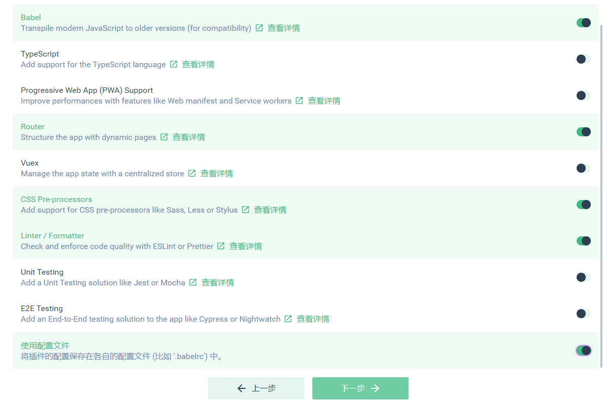
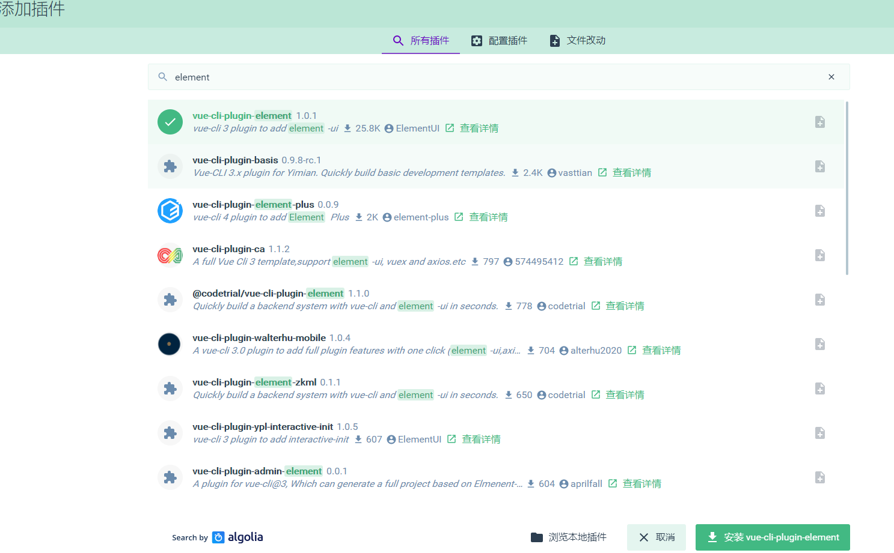
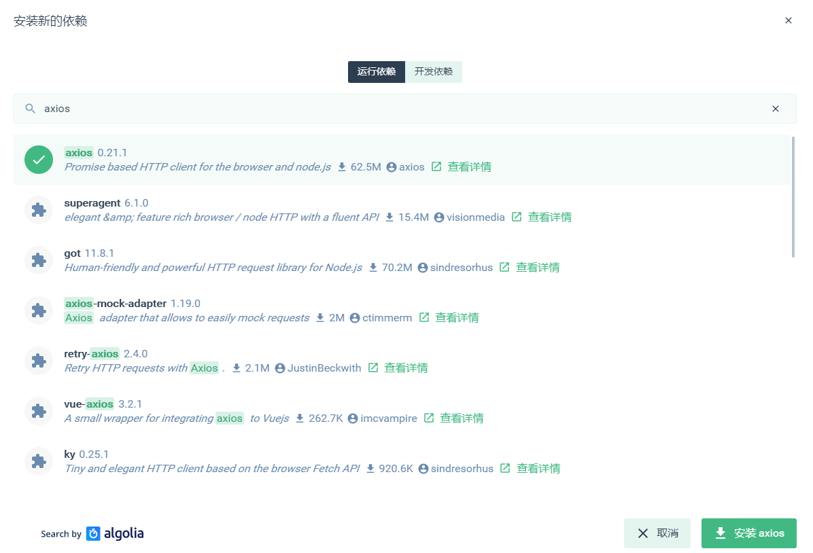
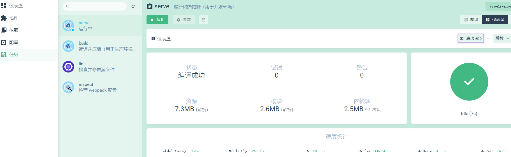
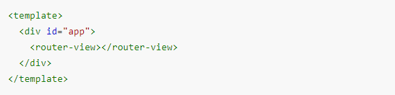
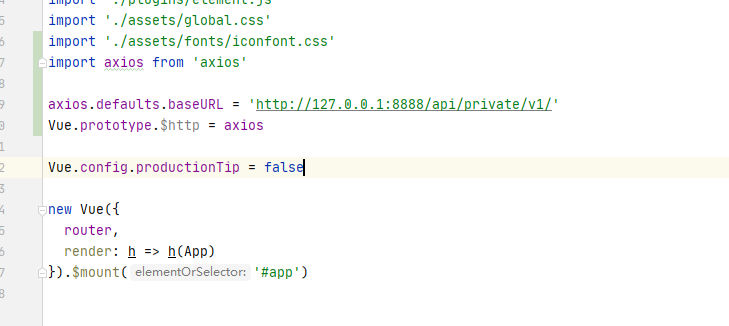

# vue-shop

## 1.项目初始化

### 1.1安装Vue脚手架

```
需要先安装node.js
npm install -g @vue/cli
```

### 1.2通过脚手架创建项目

```
vue ui  进入vue 项目管理界面
```

### 1.3创建项目，配置路由，css处理器，配置Element-ui ,配置axios








### 1.4初始化git仓库

```
git init
```

### 1.5将本地项目托管到github

## 2.实现登录功能

A.登录状态保持
如果服务器和客户端同源，建议可以使用cookie或者session来保持登录状态
如果客户端和服务器跨域了，建议使用token进行维持登录状态。

B.登录逻辑：
在登录页面输入账号和密码进行登录，将数据发送给服务器
服务器返回登录的结果，登录成功则返回数据中带有token
客户端得到token并进行保存，后续的请求都需要将此token发送给服务器，服务器会验证token以保证用户身份。

C.添加新分支login，在login分支中开发当前项目vue_shop：
打开vue_shop终端，使用git status确定当前项目状态。
确定当前工作目录是干净的之后，创建一个分支进行开发，开发完毕之后将其合并到master
git checkout -b login
然后查看新创建的分支：git branch
确定我们正在使用login分支进行开发

```
运行----------> 启动
```




### 2.1对项目的默认设置进行修改

打开项目的src目录，点击main.js文件（入口文件）

```js
import Vue from 'vue'
import App from './App.vue'
import router from './router'
import './plugins/element.js'

Vue.config.productionTip = false

new Vue({
  router,
  render: h => h(App)
}).$mount('#app')

```

再打开App.vue(根组件)，将根组件的内容进行操作梳理(template中留下根节点，script中留下默认导出，去掉组件，style中去掉所有样式,添加router-view 标签)

```vue
<template>
  <div id="app">
    <router-view></router-view>
  </div>
</template>

<script>

export default {
  name: 'app'
}
</script>

<style>
</style>

```

再打开router.js(路由)，将routes数组中的路由规则清除，然后将views删除，将components中的helloworld.vue删除

```vue
import Vue from 'vue'
import VueRouter from 'vue-router'

Vue.use(VueRouter)

const routes = []

const router = new VueRouter({
  routes
})

export default router

```

在components文件夹中新建Login.vue组件,添加template，script，style标签,style标签中的scoped可以防止组件之间的样式冲突，没有scoped则样式是全局的

```vue
<template>
    <div class="login_container">
        
    </div>
</template>

<script>
export default {
  
}
</script>

<style lang="less" scoped>
.login_container {
  background-color: #2b5b6b;
  height: 100%;
}

</style>
```

在router.js中导入组件并设置规则
在App.vue中添加路由占位符

```
import Vue from 'vue'
import VueRouter from 'vue-router'
import Login from '../components/Login'

Vue.use(VueRouter)

const routes = [
  {
    path: '/',
    redirect: '/login'
  },
  {
    path: '/login',
    component: Login
  }
]

const router = new VueRouter({
  routes
})

export default router
```



添加公共样式，在src/assets文件夹下面添加css文件夹，创建global.css文件,添加全局样式,在main.js中导入global.css，使得全局样式生效 import "./assets/global.css"

```css
/* 全局样式表 */
html,body,#app{
    width: 100%;
    height: 100%;
    margin: 0;
    padding: 0;
}

```

然后Login.vue中的根元素也需要设置撑满全屏（height:100%）,最终Login.vue文件中的代码如下

```vue
<template>
    <div class="login_container">
        <!-- 登录盒子  -->
        <div class="login_box">
            <!-- 头像 -->
            <div class="avatar_box">
                
            </div>
            <!-- 登录表单 -->
            <el-form :model="loginForm" ref="LoginFormRef" :rules="loginFormRules" label-width="0px" class="login_form">
                <!-- 用户名 -->
                <el-form-item prop="username">
                    <el-input v-model="loginForm.username" prefix-icon="iconfont icon-user" ></el-input>
                </el-form-item> 
                <!-- 密码 -->
                <el-form-item prop="password">
                    <el-input type="password" v-model="loginForm.password" prefix-icon="iconfont icon-3702mima"></el-input>
                </el-form-item> 
                <!-- 按钮 -->
                <el-form-item class="btns">
                    <el-button type="primary" @click="login">登录</el-button>
                    <el-button type="info" @click="resetLoginForm">重置</el-button>
                </el-form-item> 
            </el-form>
        </div>
    </div>
</template>

<script>
export default {
  data() {
    return {
      //数据绑定
      loginForm: {
        username: 'admin',
        password: '123456'
      },
      //表单验证规则
      loginFormRules: {
        username: [
          { required: true, message: '请输入登录名', trigger: 'blur' },
          {
            min: 3,
            max: 10,
            message: '登录名长度在 3 到 10 个字符',
            trigger: 'blur'
          }
        ],
        password: [
          { required: true, message: '请输入密码', trigger: 'blur' },
          {
            min: 6,
            max: 15,
            message: '密码长度在 6 到 15 个字符',
            trigger: 'blur'
          }
        ]
      }
    }
  },
  //添加行为，
  methods: {
    //添加表单重置方法
    resetLoginForm() {
      //this=>当前组件对象，其中的属性$refs包含了设置的表单ref
      //   console.log(this)
      this.$refs.LoginFormRef.resetFields()
    },
    login() {
      //点击登录的时候先调用validate方法验证表单内容是否有误
      this.$refs.LoginFormRef.validate(async valid => {
        console.log(this.loginFormRules)
        //如果valid参数为true则验证通过
        if (!valid) {
          return
        }

        //发送请求进行登录
        const { data: res } = await this.$http.post('login', this.loginForm)
        //   console.log(res);
        if (res.meta.status !== 200) {
          return this.$message.error('登录失败:' + res.meta.msg) //console.log("登录失败:"+res.meta.msg)
        }

        this.$message.success('登录成功')
        console.log(res)
        //保存token
        window.sessionStorage.setItem('token', res.data.token)
        // 导航至/home
        this.$router.push('/home')
      })
    }
  }
}
</script>

<style lang="less" scoped>
.login_container {
  background-color: #2b5b6b;
  height: 100%;
}
.login_box {
  width: 450px;
  height: 300px;
  background: #fff;
  border-radius: 3px;
  position: absolute;
  left: 50%;
  top: 50%;
  transform: translate(-50%, -50%);
  .avatar_box {
    height: 130px;
    width: 130px;
    border: 1px solid #eee;
    border-radius: 50%;
    padding: 10px;
    box-shadow: 0 0 10px #ddd;
    position: absolute;
    left: 50%;
    transform: translate(-50%, -50%);
    background-color: #fff;
    img {
      width: 100%;
      height: 100%;
      border-radius: 50%;
      background-color: #eee;
    }
  }
}
.login_form {
  position: absolute;
  bottom: 0;
  width: 100%;
  padding: 0 20px;
  box-sizing: border-box;
}
.btns {
  display: flex;
  justify-content: flex-end;
}
</style>

```

其中我们有用到一下内容，需要进行进一步处理：

A.添加element-ui的表单组件（**无需操作，已全部导入**）
在plugins文件夹中打开element.js文件，进行elementui的按需导入
import Vue from 'vue'
import { Button } from 'element-ui'
import { Form, FormItem } from 'element-ui'
import { Input } from 'element-ui'

Vue.use(Button)
Vue.use(Form)
Vue.use(FormItem)
Vue.use(Input)


B.添加第三方字体
复制素材中的fonts文件夹到assets中,在入口文件main.js中导入import './assets/fonts/iconfont.css'
然后直接在 <el-input prefix-icon="iconfont icon-3702mima"></el-input>
接着添加登录盒子

C.添加表单验证的步骤
1).给<el-form>添加属性:rules="rules"，rules是一堆验证规则，定义在script、中
2).在script中添加rules：export default{ data(){return{......, rules: {
          name: [
            { required: true, message: '请输入活动名称', trigger: 'blur' },
            { min: 3, max: 5, message: '长度在 3 到 5 个字符', trigger: 'blur' }
          ],
          region: [
            { required: true, message: '请选择活动区域', trigger: 'change' }
          ]
}......
3).通过<el-form-item>的prop属性设置验证规则<el-form-item label="活动名称" prop="name">

4.导入axios以发送ajax请求
打开main.js，import axios from 'axios';
设置请求的根路径：axios.defaults.baseURL = 'http://127.0.0.1:8888/api/private/v1/';
挂载axios：Vue.prototype.$http = axios;




5.配置弹窗提示：
在plugins文件夹中打开element.js文件，进行elementui的按需导入
import {Message} from 'element-ui'
进行全局挂载：Vue.prototype.$message = Message;
在login.vue组件中编写弹窗代码：this.$message.error('登录失败')

## 3.登录成功之后的操作

A.登录成功之后，需要将后台返回的token保存到sessionStorage中操作完毕之后，需要跳转到/home

```js
login() {
      //点击登录的时候先调用validate方法验证表单内容是否有误
      this.$refs.LoginFormRef.validate(async valid => {
        console.log(this.loginFormRules)
        //如果valid参数为true则验证通过
        if (!valid) {
          return
        }

        //发送请求进行登录
        const { data: res } = await this.$http.post('login', this.loginForm)
        //   console.log(res);
        if (res.meta.status !== 200) {
          return this.$message.error('登录失败:' + res.meta.msg) //console.log("登录失败:"+res.meta.msg)
        }

        this.$message.success('登录成功')
        console.log(res)
        //保存token
        window.sessionStorage.setItem('token', res.data.token)
        // 导航至/home
        this.$router.push('/home')
      })
    }
```

添加一个组件Home.vue，并为之添加规则

```
<template>
    <div>
        this is home
        <el-button type="info" @click="logout"> 退出 </el-button>
    </div>
</template>

<script>
export default {
  methods: {
    logout() {
      window.sessionStorage.clear()
      this.$router.push('/login')
    }
  }
}
</script>

<style lang='less' scoped>
</style>
```

添加路由规则

```
const routes = [
  {
    path: '/',
    redirect: '/login'
  },
  {
    path: '/login',
    component: Login
  },
  {
    path: '/home',
    component: Home
  }
]

```

添加路由守卫
如果用户没有登录，不能访问/home,如果用户通过url地址直接访问，则强制跳转到登录页面
打开router.js

```
import Vue from 'vue'
import Router from 'vue-router'
import Login from './components/Login.vue'
import Home from './components/Home.vue'

Vue.use(Router)

const router = new Router({
  routes: [
    { path:'/', redirect:'/login'},
    { path:'/login' , component:Login },
    { path:'/home' , component:Home}
  ]
})

//挂载路由导航守卫,to表示将要访问的路径，from表示从哪里来，next是下一个要做的操作
router.beforeEach((to,from,next)=>{ 
  if(to.path === '/login')
    return next();
  
  //获取token
  const tokenStr = window.sessionStorage.getItem('token');

  if(!tokenStr)
    return next('/login');

  next();

})

export default router 
```

实现退出功能
在Home组件中添加一个退出功能按钮,给退出按钮添加点击事件，添加事件处理代码如下：

```
export default {
    methods:{
        logout(){
            window.sessionStorage.clear();
            this.$router.push('/login');
        }
    }
}
```

## 4.后台首页基本布局

### 4.1打开Home.vue组件，进行布局，添加样式

### 4.2axios请求拦截器

后台除了登录接口之外，都需要token权限验证，我们可以通过添加axios请求拦截器来添加token，以保证拥有获取数据的权限
在main.js中添加代码，在将axios挂载到vue原型之前添加下面的代码

```
//请求在到达服务器之前，先会调用use中的这个回调函数来添加请求头信息
axios.interceptors.request.use(config=>{
  //为请求头对象，添加token验证的Authorization字段
  config.headers.Authorization = window.sessionStorage.getItem("token")
  return config
})
```

### 4.3侧边栏数据的获取和显示

获取数据

```js
 async getMenuList () {
      const menu = await this.$http.get('menus')
      if (menu.data.meta.status !== 200) {
        return this.$message.error(menu.data.meta.msg)
      }
      this.menuList = menu.data.data
      this.$message.success(menu.data.meta.msg)
    }
```

通过双循环显示数据

```html
  <!-- 一级菜单 -->
          <el-submenu :index="item.id+''" v-for=" item in menuList" :key="item.id">
            <!-- 一级菜单模板 -->
            <template slot="title">
              <!-- 图标 -->
              <i class="el-icon-location"></i>
              <!-- 文本 -->
              <span>{{item.authName}}</span>
            </template>
            <!-- 二级子菜单 -->
            <el-menu-item :index="subItem.id+''" v-for="subItem in item.children" :key="subItem.id">
              <!-- 二级菜单模板 -->
              <template slot="title">
                <!-- 图标 -->
                <i class="el-icon-menu"></i>
                <!-- 文本 -->
                <span>{{subItem.authName}}</span>
              </template>
            </el-menu-item>
          </el-submenu>
```

设置激活子菜单样式(todo)

制作侧边菜单栏的伸缩功能

```
  <!-- 侧边栏,宽度根据是否折叠进行设置 -->
        <el-aside :width="isCollapse ? '64px':'200px'">
          <!-- 伸缩侧边栏按钮 -->
          <div class="toggle-button" @click="toggleCollapse">|||</div>
          <!-- 侧边栏菜单，:collapse="isCollapse"（设置折叠菜单为绑定的 isCollapse 值），:collapse-transition="false"（关闭默认的折叠动画） -->
          <el-menu
          :collapse="isCollapse"
          :collapse-transition="false"
          ......
```

## 5.在后台首页添加子级路由

新增子级路由组件Welcome.vue
在router.js中导入子级路由组件，并设置路由规则以及子级路由的默认重定向
打开Home.vue，在main的主体结构中添加一个路由占位符

制作好了Welcome子级路由之后，我们需要将所有的侧边栏二级菜单都改造成子级路由链接
我们只需要将el-menu的router属性设置为true就可以了，此时当我们点击二级菜单的时候，就会根据菜单的index
属性进行路由跳转,如: /110,
使用index id来作为跳转的路径不合适，我们可以重新绑定index的值为  :index="'/'+subItem.path"

```js
 {
    path: '/home',
    component: Home,
    redirect: '/welcome',
    children: [
      {
        path: '/welcome',
        component: Welcome
      },
      {
        path: '/users',
        component: Users
      },
      {
        path: '/roles',
        component: Roles
      }
    ]
  }
```

## 6.绘制用户列表基本结构

### 6.1面包屑

```
 <el-breadcrumb separator="/">
      <el-breadcrumb-item :to="{ path: '/home' }">首页</el-breadcrumb-item>
      <el-breadcrumb-item>用户管理</el-breadcrumb-item>
      <el-breadcrumb-item>用户列表</el-breadcrumb-item>
    </el-breadcrumb>
```

### 6.2请求用户数据

```
 created () {
    this.getUserList()
  },
  methods: {
    async getUserList () {
      const { data: res } = await this.$http.get('users', { params: this.queryInfo })
      if (res.meta.status !== 200) {
        return this.$message.error(res.meta.msg)
      }
      console.log(res)
      this.$message.success(res.meta.msg)
      this.totalpage = res.data.total
      this.userList = res.data.users
    }
  }
```

### 6.3将用户列表数据展示

用户列表显示

```html
<!-- 用户列表(表格)区域 -->
<el-table :data="userList" border stripe>
    <el-table-column type="index"></el-table-column>
    <el-table-column label="姓名" prop="username"></el-table-column>
    <el-table-column label="邮箱" prop="email"></el-table-column>
    <el-table-column label="电话" prop="mobile"></el-table-column>
    <el-table-column label="角色" prop="role_name"></el-table-column>
    <el-table-column label="状态">
        <template slot-scope="scope">
            <el-switch v-model="scope.row.mg_state"></el-switch>
        </template>
    </el-table-column>
    <el-table-column label="操作" width="180px">
        <template slot-scope="scope">
            <!-- 修改 -->
            <el-button type="primary" icon="el-icon-edit" size='mini'></el-button>
            <!-- 删除 -->
            <el-button type="danger" icon="el-icon-delete" size='mini'></el-button>
            <!-- 分配角色 -->
            <el-tooltip class="item" effect="dark" content="分配角色" placement="top" :enterable="false">
                <el-button type="warning" icon="el-icon-setting" size='mini'></el-button>
            </el-tooltip>
        </template>
    </el-table-column>
</el-table>
```

实现用户列表分页

```html
<!-- 分页导航区域 
@size-change(pagesize改变时触发) 
@current-change(页码发生改变时触发)
:current-page(设置当前页码)
:page-size(设置每页的数据条数)
:total(设置总页数) -->
            <el-pagination @size-change="handleSizeChange" @current-change="handleCurrentChange" :current-page="queryInfo.pagenum" :page-sizes="[1, 2, 5, 10]" :page-size="queryInfo.pagesize" layout="total, sizes, prev, pager, next, jumper" :total="total">
            </el-pagination>
```

添加两个事件的事件处理函数@size-change，@current-change

```js
handleSizeChange(newSize) {
  //pagesize改变时触发，当pagesize发生改变的时候，我们应该
  //以最新的pagesize来请求数据并展示数据
  //   console.log(newSize)
  this.queryInfo.pagesize = newSize;
  //重新按照pagesize发送请求，请求最新的数据
  this.getUserList();  
},
handleCurrentChange( current ) {
  //页码发生改变时触发当current发生改变的时候，我们应该
  //以最新的current页码来请求数据并展示数据
  //   console.log(current)
  this.queryInfo.pagenum = current;
  //重新按照pagenum发送请求，请求最新的数据
  this.getUserList();  
}
```

###6.4实现更新用户状态

```
<el-switch v-model="scope.row.mg_state" @change="userStateChanged(scope.row)"></el-switch>
```

```
async userStateChanged(row) {
  //发送请求进行状态修改
  const { data: res } = await this.$http.put(
    `users/${row.id}/state/${row.mg_state}`
  )
  //如果返回状态为异常状态则报错并返回
  if (res.meta.status !== 200) {
    row.mg_state = !row.mg_state
    return this.$message.error('修改状态失败')
  }
  this.$message.success('更新状态成功')
},
```

### 6.5实现搜索功能

添加数据绑定，添加搜索按钮的点击事件(当用户点击搜索按钮的时候，调用getUserList方法根据文本框内容重新请求用户列表数据)
当我们在输入框中输入内容并点击搜索之后，会按照搜索关键字搜索，我们希望能够提供一个X删除搜索关键字并重新获取所有的用户列表数据，只需要给文本框添加clearable属性并添加clear事件，在clear事件中重新请求数据即可

```
<el-col :span="7">
    <el-input placeholder="请输入内容" v-model="queryInfo.query" clearable @clear="getUserList">
        <el-button slot="append" icon="el-icon-search" @click="getUserList"></el-button>
    </el-input>
</el-col>
```

### 6.6实现添加用户

A.当我们点击添加用户按钮的时候，弹出一个对话框来实现添加用户的功能，首先我们需要复制对话框组件的代码并在element.js文件中引入Dialog组件

B.接下来我们要为“添加用户”按钮添加点击事件，在事件中将addDialogVisible设置为true，即显示对话框

C.更改Dialog组件中的内容


